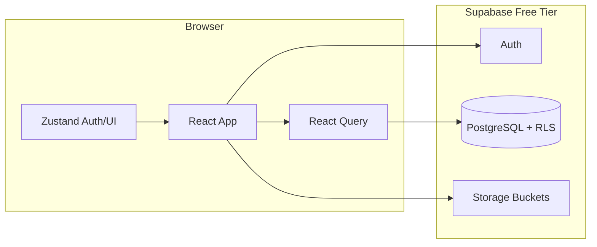

# GuardianMD

Healthcare training platform for clinical incident reporting, compliance courses, and interactive workshops. Built for hospital organizations with **admin**, **manager**, and **employee** roles.

**Live demo:** After a successful deploy, open `https://patguettler.github.io/<repo-name>/` (use your exact GitHub repo name, e.g. `guardian-md` or `guardian-md-`, with a trailing slash). CI sets the Vite `base` path automatically from `GITHUB_REPOSITORY`.

## Features by role

| Role | Capabilities |
|------|----------------|
| **Admin** | Org dashboard, course management (builder, publish), user management |
| **Manager** | Team dashboard, employee progress, assign courses, retake overrides |
| **Employee** | Personal dashboard, assigned training, course player (lessons, quizzes, workshops), profile |

### Workshop types

- **Node Map** — clickable hotspots on a floor plan
- **Decision Tree** — branching scenarios with outcomes
- **Sorting** — drag-and-drop incident categorization
- **Hotspot** — click reportable areas on a scene

## Tech stack

| Layer | Technology |
|-------|------------|
| Frontend | React 18, TypeScript, Vite |
| UI | Tailwind CSS v3, shadcn-style Radix components |
| Routing | React Router v6 |
| Server state | TanStack Query v5 |
| Client state | Zustand |
| Forms | React Hook Form + Zod |
| Motion | Framer Motion |
| Charts | Recharts |
| DnD | @dnd-kit |
| Backend | Supabase (PostgreSQL, Auth, Storage, RLS) |
| Hosting | GitHub Pages + GitHub Actions |

## Architecture



## Getting started

### Prerequisites

- Node.js 20+
- npm
- (Optional) Supabase account for production data

### Install & run (demo mode)

Without Supabase env vars, the app runs in **demo mode** with seeded courses and three demo accounts.

```bash
git clone <your-repo-url>
cd guardian-md
npm install
npm run dev
```

Open http://localhost:5173 and sign in with:

| Role | Email | Password |
|------|-------|----------|
| Admin | admin@guardianmd.demo | demo-admin-123 |
| Manager | manager@guardianmd.demo | demo-manager-123 |
| Employee | employee@guardianmd.demo | demo-employee-123 |

### Supabase setup

1. Create a project at [supabase.com](https://supabase.com)
2. Run `supabase/migrations/001_initial_schema.sql` in the SQL editor
3. Optionally run `supabase/seed.sql` (after creating matching auth users)
4. Create a **training-images** storage bucket (public read for authenticated users)
5. Copy `.env.example` to `.env`:

```env
VITE_SUPABASE_URL=https://xxxx.supabase.co
VITE_SUPABASE_ANON_KEY=your-anon-key
```

6. Restart `npm run dev`

### Environment variables

| Variable | Description |
|----------|-------------|
| `VITE_SUPABASE_URL` | Supabase project URL |
| `VITE_SUPABASE_ANON_KEY` | Supabase anon (public) key — safe in frontend; RLS enforces access |
| `GITHUB_PAGES` | Set to `true` in CI for `/guardian-md/` base path |

## Development

```bash
npm run dev      # Vite dev server + HMR
npm run build    # Production build
npm run preview  # Preview production build
```

## Deployment (GitHub Actions)

On push to `main`, `.github/workflows/deploy.yml`:

1. Installs dependencies and builds `dist/`
2. Uploads the artifact and deploys via GitHub’s official Pages actions (`upload-pages-artifact` + `deploy-pages`)

**Repository secrets to add:** `VITE_SUPABASE_URL`, `VITE_SUPABASE_ANON_KEY`

**Enable GitHub Pages:** Repository **Settings → Pages → Build and deployment → Source:** **GitHub Actions** (not “Deploy from branch”).

If you use the older `peaceiris/actions-gh-pages` action instead, set workflow permission **Contents: Read and write** (or add `contents: write` to the workflow `permissions` block).

## Database schema

See [`supabase/migrations/001_initial_schema.sql`](supabase/migrations/001_initial_schema.sql) for tables:

- `organizations`, `profiles`, `courses`, `modules`, `assignments`, `training_sessions`, `module_attempts`

Module `content` is JSONB (lesson slides, quiz questions, workshop config).

## Project structure

```
src/
  components/   # UI, layout, dashboard, training, workshops, admin
  pages/        # Route-level screens by role
  hooks/        # Data & auth hooks
  services/     # Supabase + demo data layer
  store/        # Zustand stores
  guards/       # Auth & role route guards
supabase/       # SQL migrations & seed
```

## Contributing

1. Fork the repository
2. Create a feature branch
3. Submit a pull request with a clear description and test plan

## License

See [LICENSE](LICENSE).
