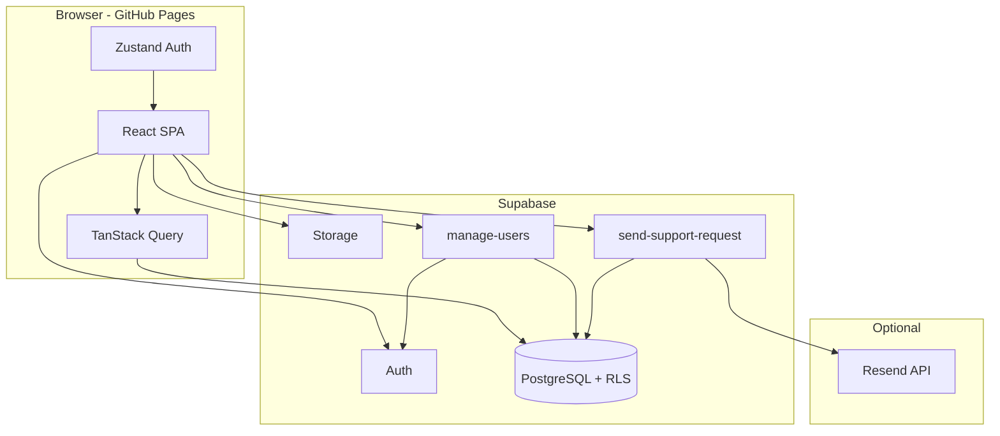

# GuardianMD

Healthcare training platform for clinical incident reporting, compliance courses, and interactive workshops. Built for hospital organizations with **platform admin**, **manager**, and **employee** roles — multi-tenant by organization, backed by Supabase, hosted on GitHub Pages.

**Live site:** [https://patguettler.github.io/guardian-md/](https://patguettler.github.io/guardian-md/)

**Repository:** [github.com/PatGuettler/guardian-md](https://github.com/PatGuettler/guardian-md)

---

## Stack

| Technology | Website |
|------------|---------|
| [React](https://react.dev) | UI library |
| [TypeScript](https://www.typescriptlang.org) | Typed JavaScript |
| [Vite](https://vite.dev) | Build tool & dev server |
| [Tailwind CSS](https://tailwindcss.com) | Utility-first styling |
| [Radix UI](https://www.radix-ui.com) | Accessible UI primitives (shadcn-style components) |
| [React Router](https://reactrouter.com) | Client-side routing |
| [TanStack Query](https://tanstack.com/query) | Server state & caching |
| [Zustand](https://zustand.docs.pmnd.rs) | Client auth & UI state |
| [React Hook Form](https://react-hook-form.com) | Form handling |
| [Zod](https://zod.dev) | Schema validation |
| [Framer Motion](https://www.framer.com/motion) | Animations |
| [Recharts](https://recharts.org) | Dashboard charts |
| [@dnd-kit](https://dndkit.com) | Drag-and-drop (workshops, course builder) |
| [jsPDF](https://github.com/parallax/jsPDF) | PDF report export |
| [Supabase](https://supabase.com) | PostgreSQL, Auth, Storage, Edge Functions, RLS |
| [Deno](https://deno.com) | Edge Function runtime (Supabase) |
| [Resend](https://resend.com) | Contact form email ([setup](#resend-support-email)) |
| [GitHub Pages](https://pages.github.com) | Static frontend hosting |
| [GitHub Actions](https://github.com/features/actions) | CI/CD deploy workflow |
| [Node.js](https://nodejs.org) | Local development (v20+) |

---

## Table of contents

- [Overview](#overview)
- [Features by role](#features-by-role)
- [Training content](#training-content)
- [Security & authentication](#security--authentication)
- [Architecture](#architecture)
- [Project structure](#project-structure)
- [Getting started](#getting-started)
- [Supabase setup](#supabase-setup)
- [Edge Functions](#edge-functions)
- [Phishing simulation](#phishing-simulation)
- [Resend (support email)](#resend-support-email)
- [Environment variables](#environment-variables)
- [Development](#development)
- [Deployment](#deployment)
- [Database schema](#database-schema)
- [Migration reference](#migration-reference)
- [Contributing](#contributing)
- [License](#license)

---

## Overview

GuardianMD is a single-page React app that talks directly to Supabase from the browser. Row Level Security (RLS) enforces org boundaries; privileged operations (user invites, password resets, support email) run in Supabase Edge Functions with the service role key.

| Layer | What runs where |
|-------|-----------------|
| **Frontend** | React SPA on GitHub Pages (`/guardian-md/` base path) |
| **Auth** | Supabase Auth (email + password, invite & reset links) |
| **Database** | PostgreSQL with RLS policies per role and org |
| **Edge Functions** | `manage-users`, `send-support-request`, `send-phishing-campaign`, `track-phishing-event` (Deno) |
| **Email (support)** | [Resend](https://resend.com) via `send-support-request` (optional) |
| **Storage** | Optional `training-images` bucket for lesson assets |

Login flow: sign in → load `profiles` row for the Auth user UUID → redirect to role dashboard.

---

## Features by role

### Platform admin (`admin`)

| Area | Capabilities |
|------|--------------|
| **Platform dashboard** | Hospital count, active/inactive users (click-through), published courses, overdue training, completion chart, PDF export |
| **All users** | Sortable platform-wide user list, last login, CSV export, user ID, status badges |
| **Hospitals** | Create/edit/delete organizations; per-hospital dashboards and drill-down |
| **Hospital analytics** | Course completion by org, staff training detail, per-course attempt history |
| **Course management** | Visual course builder (lessons, quizzes, workshops), publish to orgs, deadlines, attempt limits (including unlimited), export/import JSON |
| **Unlock requests** | Review employee lockout requests; approve retakes |
| **Platform admins** | Invite/delete platform admins (cannot delete self or last admin) |
| **Org users** | Invite single user or bulk CSV, edit roles, deactivate, unlock login, send password reset |
| **Phishing simulation** | Campaign builder, template library, dry-run sends, click/credential tracking, susceptibility dashboard |
| **Profile** | Account details + support contact form |

### Manager (`manager`)

| Area | Capabilities |
|------|--------------|
| **My team** | Employee list with training status; drill into per-employee course progress |
| **Employee detail** | Course list with status, score, pass/fail per assignment |
| **Required training** | Same course player as employees (managers take assigned courses too) |
| **Org user actions** | Unlock locked logins, send password reset (for their org) |
| **Profile** | Account details + support contact form |

### Employee (`employee`)

| Area | Capabilities |
|------|--------------|
| **My training** | Required courses with status, due dates, attempt counts |
| **Course player** | Lessons, quizzes, interactive workshops; progress saved per session |
| **Attempt limits** | Configurable max attempts per course; request unlock when locked |
| **Profile** | Name, email, role, manager, user ID, help/support form |

---

## Training content

### Module types

| Type | Description |
|------|-------------|
| **Lesson** | Slide-based content with optional built-in illustrations or **YouTube embed** (must watch ~95% before continuing) |
| **Quiz** | Multiple-choice questions with scoring |
| **Workshop** | Interactive scenarios (see below) |

### Workshop types

| Workshop | Interaction |
|----------|-------------|
| **Node Map** | Click hotspots on a hospital floor plan; answer scenario questions |
| **Decision Tree** | Branch through clinical scenarios with good/bad outcomes |
| **Sorting** | Drag-and-drop incidents into correct categories |
| **Hotspot** | Click reportable areas on a scene image |

### Course lifecycle

1. Admin builds course in the **Course Builder** (modules, order, content).
2. Admin sets **max attempts** (default 3, or **unlimited** = `0`).
3. Admin **publishes** to one or more hospitals (optional deadline).
4. Published required courses auto-create **assignments** for all org staff.
5. Employees/managers complete modules; scores and attempts persist on `assignments`.
6. When attempts are exhausted, assignment **locks**; employee can **request unlock**; admin approves.

### Export / import

Courses can be exported to JSON and imported into a new or existing course (modules, content, attempt settings). Useful for cloning content across environments.

---

## Security & authentication

| Feature | Behavior |
|---------|----------|
| **Password policy** | Minimum **10 characters** for invite and reset flows |
| **Login errors** | Generic *"Invalid login."* — no hints about password length |
| **Account lockout** | **3 failed attempts** → login locked; manager/admin can unlock or send reset |
| **Invitation flow** | Email invite → `/accept-invite` → set password; status shows *Invitation sent* until complete |
| **Password reset** | `/forgot-password` and `/reset-password`; clears lockout on success |
| **Session hygiene** | Successful login signs out other sessions; stale auth cleared on invite/reset pages |
| **RLS** | All data access scoped by org and role at the database layer |
| **Edge Functions** | JWT validated inside functions; gateway `verify_jwt = false` for CORS from GitHub Pages |

---

## Architecture



**Backend abstraction:** UI code uses `src/services/*` and `src/backend/*`. The active adapter is Supabase (`createSupabaseBackend`). The structure allows swapping to another provider later via `VITE_BACKEND`.

---

## Project structure

```
guardian-md/
├── .github/workflows/deploy.yml   # GitHub Pages CI/CD
├── public/                        # Static assets, favicon
├── scripts/
│   └── deploy-manage-users.sh     # Edge Function + auth config deploy
├── src/
│   ├── backend/                   # Backend adapter layer (Supabase)
│   ├── components/
│   │   ├── admin/                 # Course builder, org editors
│   │   ├── dashboard/             # Charts, stat cards, PDF export
│   │   ├── layout/                # App shell, sidebar, mobile nav
│   │   ├── training/              # Course player, lessons, quizzes
│   │   ├── ui/                    # shadcn-style Radix components
│   │   └── workshops/             # Interactive workshop renderers
│   ├── guards/                    # AuthGuard, RoleGuard
│   ├── hooks/                     # Data & auth hooks
│   ├── lib/                       # Utilities (password, YouTube, export, PDF)
│   ├── pages/                     # Route-level screens by role
│   ├── services/                  # API layer (calls backend)
│   ├── store/                     # Zustand stores
│   └── types/                     # TypeScript types + generated DB types
├── supabase/
│   ├── config.toml                # Auth URLs, Edge Function JWT settings
│   ├── functions/
│   │   ├── manage-users/          # User invite, CSV import, admin actions
│   │   ├── send-support-request/  # Profile help form → DB + email
│   │   └── _shared/cors.ts
│   ├── migrations/                # 001–020 SQL migrations (run in order)
│   └── seed.sql                   # Default orgs + sample courses
├── .env.example
├── package.json
└── vite.config.ts                 # GitHub Pages base path + SPA 404 fallback
```

---

## Getting started

### Prerequisites

- [Node.js](https://nodejs.org) **20+**
- npm
- [Supabase](https://supabase.com) account (free tier works for pilots)

### Install & run locally

```bash
git clone https://github.com/PatGuettler/guardian-md.git
cd guardian-md
npm install
cp .env.example .env   # add your Supabase URL and anon key
npm run dev
```

Open [http://localhost:5173](http://localhost:5173).

You need at least one user in Supabase Auth with a matching `profiles` row (see [Supabase setup](#supabase-setup)). For full user management (invites, CSV import), deploy the Edge Functions.

---

## Supabase setup

### 1. Create a project

1. [Create a project](https://supabase.com/dashboard) (save the database password).
2. Wait until status is **Active**.

### 2. Bootstrap your first admin

1. **Authentication → Users → Add user** — create an admin email/password.
2. Copy the user's **UUID**.
3. In SQL Editor:

```sql
INSERT INTO profiles (id, org_id, full_name, role, email, is_active)
VALUES (
  'PASTE_AUTH_USER_UUID',
  '00000000-0000-0000-0000-000000000099',  -- Platform Administration org
  'Your Name',
  'admin',
  'admin@yourhospital.org',
  true
);
```

Platform admins live in org `00000000-0000-0000-0000-000000000099` (hidden from the Hospitals list).

### 5. Auth URL configuration

Set in **Authentication → URL configuration** (or push via `supabase config push`):

| Setting | Production value |
|---------|------------------|
| **Site URL** | `https://patguettler.github.io/guardian-md` |
| **Redirect URLs** | `https://patguettler.github.io/guardian-md/**`, `http://localhost:5173/**` |

Local dev redirect paths: `/accept-invite`, `/reset-password`, `/login`.

### 6. Storage (optional)

Create bucket **`training-images`** (public read for authenticated users) if course content references uploaded images.

### 7. Frontend environment

Copy `.env.example` → `.env`:

```env
VITE_SUPABASE_URL=https://xxxx.supabase.co
VITE_SUPABASE_ANON_KEY=your-anon-key
```

Restart `npm run dev`.

---

## Edge Functions

Edge Functions extend Supabase Auth and support workflows. Phishing functions use `--no-verify-jwt` at the gateway (JWT is checked inside admin-only functions) so CORS preflights work from GitHub Pages.

### Prerequisites

1. [Supabase CLI](https://supabase.com/docs/guides/cli): `npm install -g supabase`
2. [Access token](https://supabase.com/dashboard/account/tokens) (`sbp_...`) — **not** the anon or service role key

```bash
export SUPABASE_ACCESS_TOKEN='sbp_...'
export SUPABASE_PROJECT_REF='your-project-ref'
supabase link --project-ref "$SUPABASE_PROJECT_REF"
```

### `manage-users`

Handles privileged user operations (admin/manager only):

| Action | Description |
|--------|-------------|
| `invite_one` | Invite a single user to an org |
| `import_csv` | Bulk invite/update from CSV |
| `update_user` | Change role, name, manager, active status |
| `delete_org_user` | Remove user from org |
| `delete_organization` | Delete a hospital |
| `invite_platform_admin` | Add platform admin |
| `delete_platform_admin` | Remove platform admin (protections apply) |
| `send_password_reset` | Email reset link; clears lockout |
| `unlock_user_login` | Clear failed-attempt lockout |

**Deploy (recommended script):**

```bash
npm run deploy:manage-users
# or: bash scripts/deploy-manage-users.sh
```

The script links the project, pushes auth config from `supabase/config.toml`, sets `INVITE_REDIRECT_URL`, and deploys with verification.

**Manual deploy:**

```bash
supabase secrets set INVITE_REDIRECT_URL=https://patguettler.github.io/guardian-md/accept-invite
supabase functions deploy manage-users --no-verify-jwt
```

For local dev: `INVITE_REDIRECT_URL=http://localhost:5173/accept-invite`

### `send-support-request`

Powers the **Profile → Contact** form. Always saves to `support_requests`; sends email through [Resend](https://resend.com) when configured.

```bash
supabase functions deploy send-support-request --project-ref "$SUPABASE_PROJECT_REF" --no-verify-jwt
```

See **[Resend (support email)](#resend-support-email)** for API keys, secrets, testing, and troubleshooting.

### `send-phishing-campaign` / `track-phishing-event`

Powers the **Phishing sims** admin module (platform admin only). See **[Phishing simulation](#phishing-simulation)**.

```bash
bash scripts/deploy-phishing.sh
```

### Auth email volume

Supabase built-in auth emails are rate-limited (~4/hour on free tier). For production invite volume, configure [custom SMTP](https://supabase.com/docs/guides/auth/auth-smtp) (SendGrid, Resend, etc.).

---

## Phishing simulation

Authorized security awareness testing for platform admins. Built into GuardianMD so remediation training can live on the same platform (roadmap: **HouseWatchmen**).

**Non-breaking:** Existing training, auth, and support flows are unchanged. The module is admin-only and optional.

### What works today (without a custom domain)

| Capability | Status |
|------------|--------|
| SQL schema + 6 email templates | Run migrations `022` and `023` |
| Campaign builder UI (`/admin/phishing/campaigns`) | Ready |
| Per-recipient tokens + event tracking | Ready |
| **Dry-run send** (no real email) | Default when `RESEND_API_KEY` is missing or `PHISHING_SIMULATION_DRY_RUN=true` |
| Fake login page (bundled) | `public/phishing-sim/login.html` on GitHub Pages |
| Training interstitial | `/phishing-training` route in the main app |
| Susceptibility dashboard | `/admin/phishing/dashboard` |

### 1. Run database migrations

In Supabase **SQL Editor** (in order):

1. [`022_phishing_simulation.sql`](supabase/migrations/022_phishing_simulation.sql) — tables + RLS
2. [`023_phishing_templates_seed.sql`](supabase/migrations/023_phishing_templates_seed.sql) — 6 starter templates
3. [`024_phishing_test_send.sql`](supabase/migrations/024_phishing_test_send.sql) — test send columns

### 2. Deploy Edge Functions

```bash
export SUPABASE_ACCESS_TOKEN='sbp_...'
export SUPABASE_PROJECT_REF='your-project-ref'
bash scripts/deploy-phishing.sh
```

Optional secrets:

```bash
# Force dry-run even when Resend is configured (recommended until domain is ready)
supabase secrets set PHISHING_SIMULATION_DRY_RUN=true --project-ref "$SUPABASE_PROJECT_REF"

# Where users land after clicking a phish link (defaults to GitHub Pages)
supabase secrets set PHISHING_TRAINING_URL='https://patguettler.github.io/guardian-md/phishing-training' --project-ref "$SUPABASE_PROJECT_REF"
```

### 3. Test mode (subset send)

While a campaign is still a **draft**:

1. Open the campaign results page
2. In **Test send**, type an email or search and pick users from the app user list
3. Click **Send test (N)** — only those addresses receive the simulation (must match a GuardianMD user)
4. Campaign stays a draft; tracking events still log normally
5. When satisfied, click **Send to everyone** for the full audience

Enable **Test mode campaign** on the edit form to flag the campaign in the list. Redeploy `send-phishing-campaign` after pulling this change.

### 4. Test without sending email

1. Sign in as platform admin → **Phishing sims**
2. **New campaign** → pick a template → select organization → **Save & build recipients**
3. Open campaign → **Send campaign** → confirm dry-run message
4. Copy a recipient token from the database (`phishing_recipients.token`) and open:
   - Click test: `https://<project>.supabase.co/functions/v1/track-phishing-event?token=TOKEN&event=click`
   - Training page: `https://patguettler.github.io/guardian-md/phishing-training?token=TOKEN`
5. Refresh campaign results — events should appear

### 5. What remains before production email

| Step | Action |
|------|--------|
| **Domain** | Buy a simulation domain (e.g. `ithelpdeskportal.com`) — see [`simulation-sites/README.md`](simulation-sites/README.md) |
| **Resend** | Verify domain; set `RESEND_API_KEY` and campaign sender addresses |
| **Fake login hosting** | Deploy `login.html` to Cloudflare Pages on that domain (private repo recommended) |
| **Disable dry-run** | `supabase secrets unset PHISHING_SIMULATION_DRY_RUN` (or set to `false`) |
| **Auth SMTP** | Optional: route Supabase auth mail through Resend ([docs](https://resend.com/docs/send-with-supabase-smtp)) |
| **Auto-remediation** | Phase 2 — auto-assign courses after click/submit (`auto_remediate` column exists) |
| **PDF/CSV export** | Phase 2 — campaign report export |

### Tracking events

| Event | How |
|-------|-----|
| `open` | 1×1 pixel (unreliable in many clients) |
| `click` | Tracked redirect URL in email |
| `credential_submission` | Fake login form POST (password **never** stored) |
| `training_viewed` | Training interstitial page load |

### Legal / scope

- Simulations are for **authorized internal training only**
- Credentials entered on fake login pages are **never stored**
- Platform admins must have organizational authority to run campaigns

---

## Resend (support email)

GuardianMD uses [Resend](https://resend.com) for the **Profile → Contact** form. Submissions are **always stored** in `support_requests`; email is optional but recommended.

| Without Resend | With Resend |
|----------------|-------------|
| Form saves to database | Form saves **and** emails the support inbox |
| User sees a “saved but not emailed” warning | User sees “Your message was sent” |

### 1. Create a Resend account

1. Sign up at [resend.com](https://resend.com)
2. **API Keys** → Create API Key → copy `re_...`

### 2. Set Supabase secrets

```bash
export SUPABASE_ACCESS_TOKEN='sbp_...'
export SUPABASE_PROJECT_REF='your-project-ref'

# Required for email delivery
supabase secrets set RESEND_API_KEY='re_...' --project-ref "$SUPABASE_PROJECT_REF"

# Where support mail is delivered (default: patguettler@gmail.com)
supabase secrets set SUPPORT_TO_EMAIL='you@example.com' --project-ref "$SUPABASE_PROJECT_REF"

# Deploy (or redeploy after changing secrets)
supabase functions deploy send-support-request --project-ref "$SUPABASE_PROJECT_REF" --no-verify-jwt
```

| Secret | Required | Description |
|--------|----------|-------------|
| `RESEND_API_KEY` | For email | From [Resend → API Keys](https://resend.com/api-keys) |
| `SUPPORT_TO_EMAIL` | No | Inbox for contact form (server default: `patguettler@gmail.com`) |
| `RESEND_FROM` | No | Sender address (default: `GuardianMD Support <onboarding@resend.dev>`) |

Run migration **`020_support_requests.sql`** if the `support_requests` table does not exist yet.

### 3. Test locally (without the app)

```bash
export RESEND_API_KEY='re_...'
export SUPPORT_TO_EMAIL='patguettler@gmail.com'
npm run test:resend-support
```

Expect **HTTP 200**. A **403** usually means the sandbox sender restriction (see below).

### 4. Sandbox vs production sender

The default `from` address is **`onboarding@resend.dev`** (Resend’s test domain). In that mode, Resend **only delivers to the email address on your Resend account** — not arbitrary inboxes.

| Goal | What to do |
|------|------------|
| Quick test | Set `SUPPORT_TO_EMAIL` to the **same email you used to sign up for Resend** |
| Production | [Verify your domain](https://resend.com/domains) in Resend, then set e.g. `RESEND_FROM='GuardianMD <support@yourdomain.com>'` |

See Resend docs: [403 error using resend.dev domain](https://resend.com/docs/knowledge-base/403-error-resend-dev-domain).

### 5. Troubleshooting

| Symptom | Likely cause |
|---------|----------------|
| “Email is not configured” / saved but not sent | `RESEND_API_KEY` not set, or function not redeployed after setting secrets |
| Success in UI but no email | Resend 403 (wrong `SUPPORT_TO_EMAIL` for sandbox); check **Supabase → Edge Functions → send-support-request → Logs** |
| Function 404 | Deploy `send-support-request` with `--no-verify-jwt` |
| CORS error from GitHub Pages | Redeploy with `--no-verify-jwt`; ensure `[functions.send-support-request] verify_jwt = false` in `supabase/config.toml` |

The edge function returns **502** with the Resend error message when delivery fails (no silent success).

---

## Environment variables

### Local / build (`.env`)

| Variable | Required | Description |
|----------|----------|-------------|
| `VITE_SUPABASE_URL` | Yes | Supabase project URL |
| `VITE_SUPABASE_ANON_KEY` | Yes | Anon (public) key — safe in frontend; RLS enforces access |
| `VITE_APP_URL` | No | Public app URL for email links (production) |
| `VITE_BACKEND` | No | Force backend adapter (`supabase`; default when configured) |
| `GITHUB_PAGES` | CI only | Set to `true` for `/guardian-md/` base path |
| `GH_PAGES_BASE` | CI only | Override base path (default `/guardian-md/`) |

### Supabase secrets (Edge Functions)

| Secret | Used by | Description |
|--------|---------|-------------|
| `INVITE_REDIRECT_URL` | `manage-users` | Where invite emails redirect |
| `RESEND_API_KEY` | `send-support-request` | Resend API key — see [Resend setup](#resend-support-email) |
| `SUPPORT_TO_EMAIL` | `send-support-request` | Support inbox (optional) |
| `RESEND_FROM` | `send-support-request` | Verified sender address (optional) |

`SUPABASE_URL`, `SUPABASE_ANON_KEY`, and `SUPABASE_SERVICE_ROLE_KEY` are injected automatically by Supabase at runtime.

### GitHub repository secrets (CI)

Add under **Settings → Secrets → Actions**:

| Secret | Description |
|--------|-------------|
| `VITE_SUPABASE_URL` | Supabase project URL |
| `VITE_SUPABASE_ANON_KEY` | Supabase anon key |

---

## Development

```bash
npm run dev            # Vite dev server + HMR (http://localhost:5173)
npm run build          # Production build (base /)
npm run build:pages    # Build matching GitHub Pages (/guardian-md/)
npm run preview        # Preview production build
npm run preview:pages  # Build + preview at /guardian-md/
npm run lint           # ESLint
npm run deploy:manage-users  # Deploy manage-users Edge Function
npm run deploy:phishing      # Deploy phishing simulation Edge Functions
npm run test:resend-support  # Test Resend API (export RESEND_API_KEY first)
npm run set-test-passwords   # Reset test user passwords (export SUPABASE_SERVICE_ROLE_KEY)
```

### Deep links on GitHub Pages

GitHub Pages only serves `index.html` at the site root. The Vite build writes a `404.html` SPA fallback when `GITHUB_PAGES=true` so routes like `/guardian-md/employee/training/play/<courseId>` work after refresh or bookmark.

---

## Deployment

### Frontend — GitHub Pages

On every push to **`main`**, or manually via **Actions → Deploy to GitHub Pages → Run workflow**, [`.github/workflows/deploy.yml`](.github/workflows/deploy.yml):

1. Installs dependencies (`npm ci`)
2. Builds with `GITHUB_PAGES=true` and Supabase secrets
3. Uploads `dist/` and deploys via official GitHub Pages actions

**Enable Pages:** Repository **Settings → Pages → Build and deployment → Source:** **GitHub Actions**.

**Verify:** [https://patguettler.github.io/guardian-md/](https://patguettler.github.io/guardian-md/)

#### Workflow did not run?

1. Push landed on **`main`** (not another branch).
2. `.github/workflows/deploy.yml` exists on remote `main`.
3. **Settings → Actions → General** — actions are enabled.
4. If deploy job is blocked: **Settings → Environments → `github-pages`** — remove required reviewers / wait timer for personal repos.

### Backend — Supabase

After schema migrations and Edge Function deploys:

1. Confirm **Site URL** and redirect URLs match production.
2. Set `INVITE_REDIRECT_URL` secret to production accept-invite URL.
3. Configure [Resend](#resend-support-email) (`RESEND_API_KEY`, deploy `send-support-request`).
4. Optional: run phishing migrations and `bash scripts/deploy-phishing.sh` (see [Phishing simulation](#phishing-simulation)).

Edge Functions and database are **not** deployed by the GitHub Actions workflow — run migrations and function deploys manually (see above).

---

## Database schema

Core tables (see [`001_initial_schema.sql`](supabase/migrations/001_initial_schema.sql)):

| Table | Purpose |
|-------|---------|
| `organizations` | Hospitals / tenants |
| `profiles` | User role, org, manager, email, lockout, invitation status |
| `courses` | Training courses (`max_attempts`, publish flag) |
| `modules` | Lesson / quiz / workshop content (JSONB) |
| `assignments` | Per-user course assignment, status, score, attempts, lock |
| `training_sessions` | Course attempt sessions |
| `module_attempts` | Per-module progress within a session |
| `course_publications` | Publish courses to orgs with optional deadline |
| `course_unlock_requests` | Employee unlock requests (pending/approved/denied) |
| `support_requests` | Profile help form submissions |
| `phishing_templates` | Phishing email template library |
| `phishing_campaigns` | Simulation campaigns (draft → sent) |
| `phishing_recipients` | Per-user tracking tokens |
| `phishing_events` | Opens, clicks, credential submits, training views |

Module `content` is JSONB — lesson slides, quiz questions, workshop config, YouTube URLs, etc.

Roles: `admin` (platform), `manager`, `employee` — one org per user, one role per user.

---

## Migration reference

All migrations live in [`supabase/migrations/`](supabase/migrations/). Always run in order on a fresh database. On an existing database, run only migrations you have not yet applied.

For a detailed production walkthrough (manual user bootstrap, manager/employee setup), see [`poc.md`](poc.md).

---

## Contributing

1. Fork the repository
2. Create a feature branch
3. Run `npm run lint` and `npm run build`
4. Submit a pull request with a clear description and test plan

---

## License

See [LICENSE](LICENSE).
