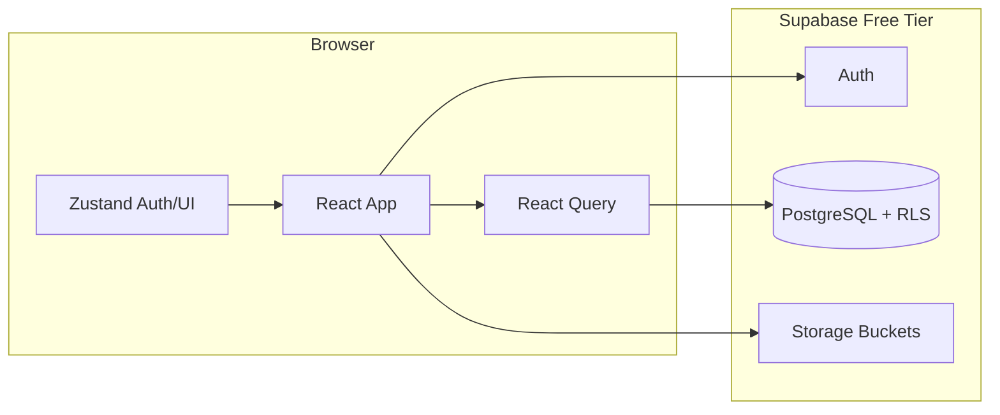

# GuardianMD

Healthcare training platform for clinical incident reporting, compliance courses, and interactive workshops. Built for hospital organizations with **admin**, **manager**, and **employee** roles.

**Live site:** [https://patguettler.github.io/guardian-md/](https://patguettler.github.io/guardian-md/)

**Repository:** [github.com/PatGuettler/guardian-md](https://github.com/PatGuettler/guardian-md)

CI builds with base path `/guardian-md/` (from `GITHUB_REPOSITORY` on push to `main`).

## Features by role

| Role | Capabilities |
|------|----------------|
| **Admin** | Org dashboard, course management (builder, publish, attempt limits), unlock requests, user management |
| **Manager** | Team dashboard, employee progress, required training (same as staff) |
| **Employee** | Personal dashboard, required training, course player (lessons, quizzes, workshops) |

### Workshop types

- **Node Map** — clickable hotspots on a floor plan
- **Decision Tree** — branching scenarios with outcomes
- **Sorting** — drag-and-drop incident categorization
- **Hotspot** — click reportable areas on a scene

## Tech stack

| Layer | Technology |
|-------|------------|
| Frontend | React 18, TypeScript, Vite |
| UI | Tailwind CSS v3, shadcn-style Radix components |
| Routing | React Router v6 |
| Server state | TanStack Query v5 |
| Client state | Zustand |
| Forms | React Hook Form + Zod |
| Motion | Framer Motion |
| Charts | Recharts |
| DnD | @dnd-kit |
| Backend | Supabase (PostgreSQL, Auth, Storage, RLS) |
| Hosting | GitHub Pages + GitHub Actions |

## Architecture



## Getting started

### Prerequisites

- Node.js 20+
- npm
- Supabase account (required)

### Install & run

```bash
git clone https://github.com/PatGuettler/guardian-md.git
cd guardian-md
npm install
cp .env.example .env   # add your Supabase URL and anon key
npm run dev
```

Open http://localhost:5173 and sign in with a user created in Supabase Auth.

### Supabase setup

1. Create a project at [supabase.com](https://supabase.com)
2. Run migrations in order in the SQL editor:
   - `supabase/migrations/001_initial_schema.sql`
   - `supabase/migrations/002_platform_admin_and_profile_email.sql`
   - `supabase/migrations/003_org_admin_delete.sql` (required for deleting hospitals)
   - `supabase/migrations/004_admin_assignments_select.sql` (platform dashboard stats)
   - `supabase/migrations/005_course_publications.sql` (publish courses to orgs + deadlines)
   - `supabase/migrations/006_course_access_via_publication.sql` (block removed courses)
   - `supabase/migrations/007_required_course_assignments.sql` (auto-required training for all staff)
   - `supabase/migrations/008_course_attempt_limits.sql` (max attempts per course, lockout, unlock requests)
   - `supabase/migrations/009_assignment_attempt_result_rpc.sql` (employees can finish courses via RPC)
   - `supabase/migrations/010_assignment_scores.sql` (persist course scores on assignments for dashboards)
   - `supabase/migrations/011_assignments_update_own.sql` (**required** — employees can finish courses)
3. Run `supabase/seed.sql` to create the default organization and courses
4. Bootstrap your admin account with `supabase/bootstrap-admin.sql` (see file comments)
5. *(Optional, dev only)* Run `supabase/bootstrap-test-users.sql` for manager/employee test logins (see file for credentials)
6. Deploy the `manage-users` Edge Function (one-time, see below — required for inviting users)
7. Import course modules from `src/data/courses.ts` via the admin course builder, or extend `seed.sql`
8. Create a **training-images** storage bucket (public read for authenticated users)
9. Copy `.env.example` to `.env`:

```env
VITE_SUPABASE_URL=https://xxxx.supabase.co
VITE_SUPABASE_ANON_KEY=your-anon-key
```

10. Restart `npm run dev`

### Organizations & user management

Admins use **Organizations** to manage hospitals. Each org has its own users (one org per user, one role per user).

- **Add one user:** email + optional name; defaults to **employee**; pick role if needed
- **Bulk CSV:** only `email` required; `full_name`, `role`, `manager_email` optional (role defaults to employee)
- **Change roles:** edit role per user in the org user table

**Deploy the Edge Function (one time):**

```bash
npm install -g supabase
supabase login
supabase link --project-ref YOUR_PROJECT_REF
supabase secrets set INVITE_REDIRECT_URL=https://patguettler.github.io/guardian-md/login
supabase functions deploy manage-users
```

For local dev, set `INVITE_REDIRECT_URL=http://localhost:5173/login` instead.

**Free tier:** GitHub Pages hosting is free. Supabase free tier includes Edge Functions, Auth, and Postgres — enough for a hospital pilot. Built-in auth emails are rate-limited (~4/hour); for hundreds of invites configure [custom SMTP](https://supabase.com/docs/guides/auth/auth-smtp) in Supabase (SendGrid, Resend, etc. have free tiers).

### Environment variables

| Variable | Description |
|----------|-------------|
| `VITE_SUPABASE_URL` | Supabase project URL |
| `VITE_SUPABASE_ANON_KEY` | Supabase anon (public) key — safe in frontend; RLS enforces access |
| `GITHUB_PAGES` | Set to `true` in CI for `/guardian-md/` base path |

## Development

```bash
npm run dev           # Vite dev server + HMR
npm run build         # Production build (local, base /)
npm run build:pages   # Production build matching GitHub Pages (/guardian-md/)
npm run preview:pages # Build + preview at http://localhost:4173/guardian-md/
```

## Deployment (GitHub Actions)

On every push to **`main`**, or manually via **Actions → Deploy to GitHub Pages → Run workflow**, `.github/workflows/deploy.yml`:

### Workflow did not run after `git push`?

The workflow file is valid; GitHub only auto-starts it when all of these are true:

1. **Push landed on `main`** — not `master` or another branch. Check: `git branch --show-current` and `git log origin/main -1`.
2. **Push went to the Pages repo** — [github.com/PatGuettler/guardian-md](https://github.com/PatGuettler/guardian-md), not a differently named fork or `guardian-md-` remote.
3. **`.github/workflows/deploy.yml` exists on GitHub `main`** — open that path on the repo in the browser; if it is missing, commit and push the workflow.
4. **Actions are enabled** — repo **Settings → Actions → General → Allow all actions** (or allow for this repo).
5. **You are viewing the Actions tab on the same repo** you pushed to.

If the **build** job runs but **deploy** does not, use **Settings → Pages → Source: GitHub Actions** and ensure the `github-pages` environment exists (first deploy may require approving the environment).

### “Failed to queue workflow run” on **Run workflow**

Push-to-`main` deploys are the reliable path (see green runs in Actions). If manual **Run workflow** fails to queue:

1. **Cancel** any in-progress “Deploy to GitHub Pages” or “pages-build-deployment” runs.
2. **Settings → Environments → `github-pages`** — remove **Required reviewers** and **Wait timer** (personal repos often block manual runs otherwise).
3. **Settings → Actions → General → Workflow permissions** — choose **Read and write permissions**.
4. Wait a minute and retry, or **`git push origin main`** instead (same workflow).

The deploy workflow intentionally omits `environment.url` tied to step outputs; that pattern can prevent manual runs from queuing on some repos.

1. Installs dependencies and builds `dist/`
2. Uploads the artifact and deploys via GitHub’s official Pages actions (`upload-pages-artifact` + `deploy-pages`)

**Repository secrets to add:** `VITE_SUPABASE_URL`, `VITE_SUPABASE_ANON_KEY`

**Enable GitHub Pages:** Repository **Settings → Pages → Build and deployment → Source:** **GitHub Actions** (not “Deploy from branch”).

If you use the older `peaceiris/actions-gh-pages` action instead, set workflow permission **Contents: Read and write** (or add `contents: write` to the workflow `permissions` block).

### Direct links / refresh on a course URL

GitHub Pages only serves `index.html` at the site root. Deep paths like `/guardian-md/employee/training/play/<courseId>` need a `404.html` that redirects to the app root; the app then restores the URL client-side. The Vite build writes this file when `GITHUB_PAGES=true` (set in the deploy workflow). After deploying, hard-refresh or open the course from **My Training** once, then bookmarking and refresh should work.

## Database schema

See [`supabase/migrations/001_initial_schema.sql`](supabase/migrations/001_initial_schema.sql) for tables:

- `organizations`, `profiles`, `courses`, `modules`, `assignments`, `training_sessions`, `module_attempts`

Module `content` is JSONB (lesson slides, quiz questions, workshop config).

## Project structure

```
src/
  components/   # UI, layout, dashboard, training, workshops, admin
  pages/        # Route-level screens by role
  hooks/        # Data & auth hooks
  data/         # Seed course catalog (courses + modules)
  services/     # Supabase API layer
  store/        # Zustand stores
  guards/       # Auth & role route guards
supabase/       # SQL migrations & seed
```

## Contributing

1. Fork the repository
2. Create a feature branch
3. Submit a pull request with a clear description and test plan

## License

See [LICENSE](LICENSE).
