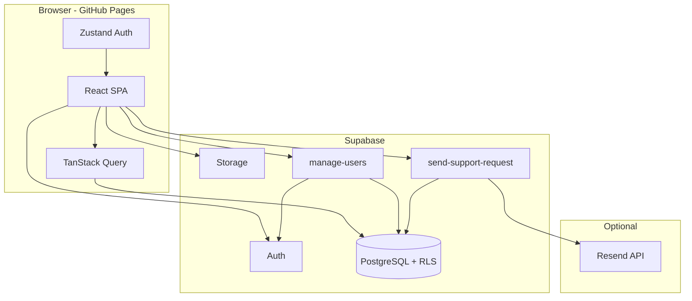

# GuardianMD

Healthcare training platform for clinical incident reporting, compliance courses, and interactive workshops. Built for hospital organizations with **platform admin**, **manager**, and **employee** roles — multi-tenant by organization, backed by Supabase, hosted on GitHub Pages.

**Live site:** [https://patguettler.github.io/guardian-md/](https://patguettler.github.io/guardian-md/)

**Repository:** [github.com/PatGuettler/guardian-md](https://github.com/PatGuettler/guardian-md)

---

## Stack

| Technology | Website |
|------------|---------|
| [React](https://react.dev) | UI library |
| [TypeScript](https://www.typescriptlang.org) | Typed JavaScript |
| [Vite](https://vite.dev) | Build tool & dev server |
| [Tailwind CSS](https://tailwindcss.com) | Utility-first styling |
| [Radix UI](https://www.radix-ui.com) | Accessible UI primitives (shadcn-style components) |
| [React Router](https://reactrouter.com) | Client-side routing |
| [TanStack Query](https://tanstack.com/query) | Server state & caching |
| [Zustand](https://zustand.docs.pmnd.rs) | Client auth & UI state |
| [React Hook Form](https://react-hook-form.com) | Form handling |
| [Zod](https://zod.dev) | Schema validation |
| [Framer Motion](https://www.framer.com/motion) | Animations |
| [Recharts](https://recharts.org) | Dashboard charts |
| [@dnd-kit](https://dndkit.com) | Drag-and-drop (workshops, course builder) |
| [jsPDF](https://github.com/parallax/jsPDF) | PDF report export |
| [Supabase](https://supabase.com) | PostgreSQL, Auth, Storage, Edge Functions, RLS |
| [Deno](https://deno.com) | Edge Function runtime (Supabase) |
| [Resend](https://resend.com) | Optional transactional email (support form) |
| [GitHub Pages](https://pages.github.com) | Static frontend hosting |
| [GitHub Actions](https://github.com/features/actions) | CI/CD deploy workflow |
| [Node.js](https://nodejs.org) | Local development (v20+) |

---

## Table of contents

- [Overview](#overview)
- [Features by role](#features-by-role)
- [Training content](#training-content)
- [Security & authentication](#security--authentication)
- [Architecture](#architecture)
- [Project structure](#project-structure)
- [Getting started](#getting-started)
- [Supabase setup](#supabase-setup)
- [Edge Functions](#edge-functions)
- [Environment variables](#environment-variables)
- [Development](#development)
- [Deployment](#deployment)
- [Database schema](#database-schema)
- [Migration reference](#migration-reference)
- [Contributing](#contributing)
- [License](#license)

---

## Overview

GuardianMD is a single-page React app that talks directly to Supabase from the browser. Row Level Security (RLS) enforces org boundaries; privileged operations (user invites, password resets, support email) run in Supabase Edge Functions with the service role key.

| Layer | What runs where |
|-------|-----------------|
| **Frontend** | React SPA on GitHub Pages (`/guardian-md/` base path) |
| **Auth** | Supabase Auth (email + password, invite & reset links) |
| **Database** | PostgreSQL with RLS policies per role and org |
| **Edge Functions** | `manage-users`, `send-support-request` (Deno) |
| **Storage** | Optional `training-images` bucket for lesson assets |

Login flow: sign in → load `profiles` row for the Auth user UUID → redirect to role dashboard.

---

## Features by role

### Platform admin (`admin`)

| Area | Capabilities |
|------|--------------|
| **Platform dashboard** | Hospital count, active/inactive users (click-through), published courses, overdue training, completion chart, PDF export |
| **All users** | Sortable platform-wide user list, last login, CSV export, user ID, status badges |
| **Hospitals** | Create/edit/delete organizations; per-hospital dashboards and drill-down |
| **Hospital analytics** | Course completion by org, staff training detail, per-course attempt history |
| **Course management** | Visual course builder (lessons, quizzes, workshops), publish to orgs, deadlines, attempt limits (including unlimited), export/import JSON |
| **Unlock requests** | Review employee lockout requests; approve retakes |
| **Platform admins** | Invite/delete platform admins (cannot delete self or last admin) |
| **Org users** | Invite single user or bulk CSV, edit roles, deactivate, unlock login, send password reset |
| **Profile** | Account details + support contact form |

### Manager (`manager`)

| Area | Capabilities |
|------|--------------|
| **My team** | Employee list with training status; drill into per-employee course progress |
| **Employee detail** | Course list with status, score, pass/fail per assignment |
| **Required training** | Same course player as employees (managers take assigned courses too) |
| **Org user actions** | Unlock locked logins, send password reset (for their org) |
| **Profile** | Account details + support contact form |

### Employee (`employee`)

| Area | Capabilities |
|------|--------------|
| **My training** | Required courses with status, due dates, attempt counts |
| **Course player** | Lessons, quizzes, interactive workshops; progress saved per session |
| **Attempt limits** | Configurable max attempts per course; request unlock when locked |
| **Profile** | Name, email, role, manager, user ID, help/support form |

---

## Training content

### Module types

| Type | Description |
|------|-------------|
| **Lesson** | Slide-based content with optional built-in illustrations or **YouTube embed** (must watch ~95% before continuing) |
| **Quiz** | Multiple-choice questions with scoring |
| **Workshop** | Interactive scenarios (see below) |

### Workshop types

| Workshop | Interaction |
|----------|-------------|
| **Node Map** | Click hotspots on a hospital floor plan; answer scenario questions |
| **Decision Tree** | Branch through clinical scenarios with good/bad outcomes |
| **Sorting** | Drag-and-drop incidents into correct categories |
| **Hotspot** | Click reportable areas on a scene image |

### Course lifecycle

1. Admin builds course in the **Course Builder** (modules, order, content).
2. Admin sets **max attempts** (default 3, or **unlimited** = `0`).
3. Admin **publishes** to one or more hospitals (optional deadline).
4. Published required courses auto-create **assignments** for all org staff.
5. Employees/managers complete modules; scores and attempts persist on `assignments`.
6. When attempts are exhausted, assignment **locks**; employee can **request unlock**; admin approves.

### Export / import

Courses can be exported to JSON and imported into a new or existing course (modules, content, attempt settings). Useful for cloning content across environments.

---

## Security & authentication

| Feature | Behavior |
|---------|----------|
| **Password policy** | Minimum **10 characters** for invite and reset flows |
| **Login errors** | Generic *"Invalid login."* — no hints about password length |
| **Account lockout** | **3 failed attempts** → login locked; manager/admin can unlock or send reset |
| **Invitation flow** | Email invite → `/accept-invite` → set password; status shows *Invitation sent* until complete |
| **Password reset** | `/forgot-password` and `/reset-password`; clears lockout on success |
| **Session hygiene** | Successful login signs out other sessions; stale auth cleared on invite/reset pages |
| **RLS** | All data access scoped by org and role at the database layer |
| **Edge Functions** | JWT validated inside functions; gateway `verify_jwt = false` for CORS from GitHub Pages |

---

## Architecture



**Backend abstraction:** UI code uses `src/services/*` and `src/backend/*`. The active adapter is Supabase (`createSupabaseBackend`). The structure allows swapping to another provider later via `VITE_BACKEND`.

---

## Project structure

```
guardian-md/
├── .github/workflows/deploy.yml   # GitHub Pages CI/CD
├── public/                        # Static assets, favicon
├── scripts/
│   └── deploy-manage-users.sh     # Edge Function + auth config deploy
├── src/
│   ├── backend/                   # Backend adapter layer (Supabase)
│   ├── components/
│   │   ├── admin/                 # Course builder, org editors
│   │   ├── dashboard/             # Charts, stat cards, PDF export
│   │   ├── layout/                # App shell, sidebar, mobile nav
│   │   ├── training/              # Course player, lessons, quizzes
│   │   ├── ui/                    # shadcn-style Radix components
│   │   └── workshops/             # Interactive workshop renderers
│   ├── guards/                    # AuthGuard, RoleGuard
│   ├── hooks/                     # Data & auth hooks
│   ├── lib/                       # Utilities (password, YouTube, export, PDF)
│   ├── pages/                     # Route-level screens by role
│   ├── services/                  # API layer (calls backend)
│   ├── store/                     # Zustand stores
│   └── types/                     # TypeScript types + generated DB types
├── supabase/
│   ├── config.toml                # Auth URLs, Edge Function JWT settings
│   ├── functions/
│   │   ├── manage-users/          # User invite, CSV import, admin actions
│   │   ├── send-support-request/  # Profile help form → DB + email
│   │   └── _shared/cors.ts
│   ├── migrations/                # 001–020 SQL migrations (run in order)
│   └── seed.sql                   # Default orgs + sample courses
├── .env.example
├── package.json
└── vite.config.ts                 # GitHub Pages base path + SPA 404 fallback
```

---

## Getting started

### Prerequisites

- [Node.js](https://nodejs.org) **20+**
- npm
- [Supabase](https://supabase.com) account (free tier works for pilots)

### Install & run locally

```bash
git clone https://github.com/PatGuettler/guardian-md.git
cd guardian-md
npm install
cp .env.example .env   # add your Supabase URL and anon key
npm run dev
```

Open [http://localhost:5173](http://localhost:5173).

You need at least one user in Supabase Auth with a matching `profiles` row (see [Supabase setup](#supabase-setup)). For full user management (invites, CSV import), deploy the Edge Functions.

---

## Supabase setup

### 1. Create a project

1. [Create a project](https://supabase.com/dashboard) (save the database password).
2. Wait until status is **Active**.

### 2. Run migrations

In **SQL Editor**, run each file in `supabase/migrations/` **in numeric order**:

| # | File | Purpose |
|---|------|---------|
| 001 | `001_initial_schema.sql` | Core tables, RLS, auth helpers |
| 002 | `002_platform_admin_and_profile_email.sql` | Platform admin policies, profile email |
| 003 | `003_org_admin_delete.sql` | Admin can delete hospitals |
| 004 | `004_admin_assignments_select.sql` | Cross-org dashboard stats |
| 005 | `005_course_publications.sql` | Publish courses to orgs + deadlines |
| 006 | `006_course_access_via_publication.sql` | Block access to unpublished courses |
| 007 | `007_required_course_assignments.sql` | Auto-assign required training |
| 008 | `008_course_attempt_limits.sql` | Max attempts, lockout, unlock requests |
| 009 | `009_assignment_attempt_result_rpc.sql` | Record course completion via RPC |
| 010 | `010_assignment_scores.sql` | Persist scores on assignments |
| 011 | `011_assignments_update_own.sql` | **Required** — employees finish courses |
| 012 | `012_admin_training_analytics_rls.sql` | Admin cross-hospital analytics |
| 013 | `013_fix_attempt_counts.sql` | Correct attempt counting logic |
| 014 | `014_backfill_attempt_counts.sql` | Backfill existing assignments |
| 015 | `015_invitation_pending.sql` | Invitation-sent status tracking |
| 016 | `016_account_lockout.sql` | Failed login lockout RPCs |
| 017 | `017_course_unlock_admin.sql` | Admin approve unlock + assignment update RLS |
| 018 | `018_profile_last_login.sql` | Sync `last_login_at` from Auth |
| 019 | `019_unlimited_course_attempts.sql` | `max_attempts = 0` = unlimited |
| 020 | `020_support_requests.sql` | Support form submissions table |

### 3. Seed data (optional)

```bash
# Run supabase/seed.sql in SQL Editor
```

Creates default organizations and sample course stubs. Full module content is built in the admin **Course Builder** or imported via JSON.

### 4. Bootstrap your first admin

1. **Authentication → Users → Add user** — create an admin email/password.
2. Copy the user's **UUID**.
3. In SQL Editor:

```sql
INSERT INTO profiles (id, org_id, full_name, role, email, is_active)
VALUES (
  'PASTE_AUTH_USER_UUID',
  '00000000-0000-0000-0000-000000000099',  -- Platform Administration org
  'Your Name',
  'admin',
  'admin@yourhospital.org',
  true
);
```

Platform admins live in org `00000000-0000-0000-0000-000000000099` (hidden from the Hospitals list).

### 5. Auth URL configuration

Set in **Authentication → URL configuration** (or push via `supabase config push`):

| Setting | Production value |
|---------|------------------|
| **Site URL** | `https://patguettler.github.io/guardian-md` |
| **Redirect URLs** | `https://patguettler.github.io/guardian-md/**`, `http://localhost:5173/**` |

Local dev redirect paths: `/accept-invite`, `/reset-password`, `/login`.

### 6. Storage (optional)

Create bucket **`training-images`** (public read for authenticated users) if course content references uploaded images.

### 7. Frontend environment

Copy `.env.example` → `.env`:

```env
VITE_SUPABASE_URL=https://xxxx.supabase.co
VITE_SUPABASE_ANON_KEY=your-anon-key
```

Restart `npm run dev`.

---

## Edge Functions

Two Edge Functions extend Supabase Auth and support workflows. Both use `--no-verify-jwt` at the gateway (JWT is checked inside the function) so CORS preflights work from GitHub Pages.

### Prerequisites

1. [Supabase CLI](https://supabase.com/docs/guides/cli): `npm install -g supabase`
2. [Access token](https://supabase.com/dashboard/account/tokens) (`sbp_...`) — **not** the anon or service role key

```bash
export SUPABASE_ACCESS_TOKEN='sbp_...'
export SUPABASE_PROJECT_REF='your-project-ref'
supabase link --project-ref "$SUPABASE_PROJECT_REF"
```

### `manage-users`

Handles privileged user operations (admin/manager only):

| Action | Description |
|--------|-------------|
| `invite_one` | Invite a single user to an org |
| `import_csv` | Bulk invite/update from CSV |
| `update_user` | Change role, name, manager, active status |
| `delete_org_user` | Remove user from org |
| `delete_organization` | Delete a hospital |
| `invite_platform_admin` | Add platform admin |
| `delete_platform_admin` | Remove platform admin (protections apply) |
| `send_password_reset` | Email reset link; clears lockout |
| `unlock_user_login` | Clear failed-attempt lockout |

**Deploy (recommended script):**

```bash
npm run deploy:manage-users
# or: bash scripts/deploy-manage-users.sh
```

The script links the project, pushes auth config from `supabase/config.toml`, sets `INVITE_REDIRECT_URL`, and deploys with verification.

**Manual deploy:**

```bash
supabase secrets set INVITE_REDIRECT_URL=https://patguettler.github.io/guardian-md/accept-invite
supabase functions deploy manage-users --no-verify-jwt
```

For local dev: `INVITE_REDIRECT_URL=http://localhost:5173/accept-invite`

### `send-support-request`

Powers the **Profile → Help** form. Stores submissions in `support_requests`; sends email via Resend when configured.

```bash
# Optional — without this, requests are saved but email is only logged
supabase secrets set RESEND_API_KEY='re_...'

supabase functions deploy send-support-request --no-verify-jwt
```

### Auth email volume

Supabase built-in auth emails are rate-limited (~4/hour on free tier). For production invite volume, configure [custom SMTP](https://supabase.com/docs/guides/auth/auth-smtp) (SendGrid, Resend, etc.).

---

## Environment variables

### Local / build (`.env`)

| Variable | Required | Description |
|----------|----------|-------------|
| `VITE_SUPABASE_URL` | Yes | Supabase project URL |
| `VITE_SUPABASE_ANON_KEY` | Yes | Anon (public) key — safe in frontend; RLS enforces access |
| `VITE_APP_URL` | No | Public app URL for email links (production) |
| `VITE_BACKEND` | No | Force backend adapter (`supabase`; default when configured) |
| `GITHUB_PAGES` | CI only | Set to `true` for `/guardian-md/` base path |
| `GH_PAGES_BASE` | CI only | Override base path (default `/guardian-md/`) |

### Supabase secrets (Edge Functions)

| Secret | Used by | Description |
|--------|---------|-------------|
| `INVITE_REDIRECT_URL` | `manage-users` | Where invite emails redirect |
| `RESEND_API_KEY` | `send-support-request` | Optional email delivery |

`SUPABASE_URL`, `SUPABASE_ANON_KEY`, and `SUPABASE_SERVICE_ROLE_KEY` are injected automatically by Supabase at runtime.

### GitHub repository secrets (CI)

Add under **Settings → Secrets → Actions**:

| Secret | Description |
|--------|-------------|
| `VITE_SUPABASE_URL` | Supabase project URL |
| `VITE_SUPABASE_ANON_KEY` | Supabase anon key |

---

## Development

```bash
npm run dev            # Vite dev server + HMR (http://localhost:5173)
npm run build          # Production build (base /)
npm run build:pages    # Build matching GitHub Pages (/guardian-md/)
npm run preview        # Preview production build
npm run preview:pages  # Build + preview at /guardian-md/
npm run lint           # ESLint
npm run deploy:manage-users  # Deploy manage-users Edge Function
```

### Deep links on GitHub Pages

GitHub Pages only serves `index.html` at the site root. The Vite build writes a `404.html` SPA fallback when `GITHUB_PAGES=true` so routes like `/guardian-md/employee/training/play/<courseId>` work after refresh or bookmark.

---

## Deployment

### Frontend — GitHub Pages

On every push to **`main`**, or manually via **Actions → Deploy to GitHub Pages → Run workflow**, [`.github/workflows/deploy.yml`](.github/workflows/deploy.yml):

1. Installs dependencies (`npm ci`)
2. Builds with `GITHUB_PAGES=true` and Supabase secrets
3. Uploads `dist/` and deploys via official GitHub Pages actions

**Enable Pages:** Repository **Settings → Pages → Build and deployment → Source:** **GitHub Actions**.

**Verify:** [https://patguettler.github.io/guardian-md/](https://patguettler.github.io/guardian-md/)

#### Workflow did not run?

1. Push landed on **`main`** (not another branch).
2. `.github/workflows/deploy.yml` exists on remote `main`.
3. **Settings → Actions → General** — actions are enabled.
4. If deploy job is blocked: **Settings → Environments → `github-pages`** — remove required reviewers / wait timer for personal repos.

### Backend — Supabase

After schema migrations and Edge Function deploys:

1. Confirm **Site URL** and redirect URLs match production.
2. Set `INVITE_REDIRECT_URL` secret to production accept-invite URL.
3. Optionally set `RESEND_API_KEY` for support emails.

Edge Functions and database are **not** deployed by the GitHub Actions workflow — run migrations and function deploys manually (see above).

---

## Database schema

Core tables (see [`001_initial_schema.sql`](supabase/migrations/001_initial_schema.sql)):

| Table | Purpose |
|-------|---------|
| `organizations` | Hospitals / tenants |
| `profiles` | User role, org, manager, email, lockout, invitation status |
| `courses` | Training courses (`max_attempts`, publish flag) |
| `modules` | Lesson / quiz / workshop content (JSONB) |
| `assignments` | Per-user course assignment, status, score, attempts, lock |
| `training_sessions` | Course attempt sessions |
| `module_attempts` | Per-module progress within a session |
| `course_publications` | Publish courses to orgs with optional deadline |
| `course_unlock_requests` | Employee unlock requests (pending/approved/denied) |
| `support_requests` | Profile help form submissions |

Module `content` is JSONB — lesson slides, quiz questions, workshop config, YouTube URLs, etc.

Roles: `admin` (platform), `manager`, `employee` — one org per user, one role per user.

---

## Migration reference

All migrations live in [`supabase/migrations/`](supabase/migrations/). Always run in order on a fresh database. On an existing database, run only migrations you have not yet applied.

For a detailed production walkthrough (manual user bootstrap, manager/employee setup), see [`poc.md`](poc.md).

---

## Contributing

1. Fork the repository
2. Create a feature branch
3. Run `npm run lint` and `npm run build`
4. Submit a pull request with a clear description and test plan

---

## License

See [LICENSE](LICENSE).
